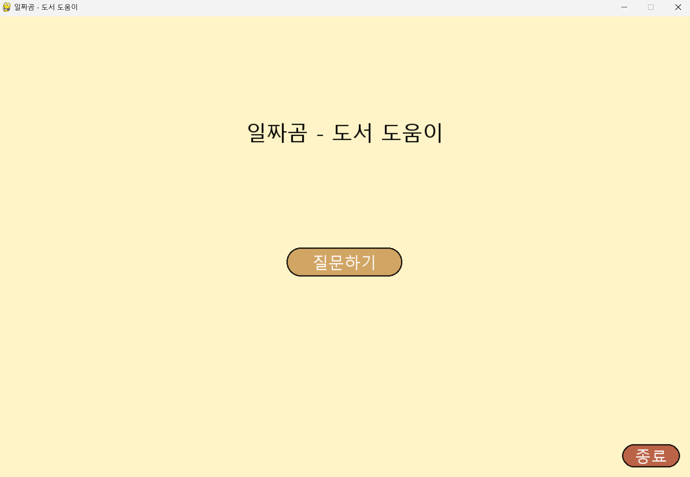
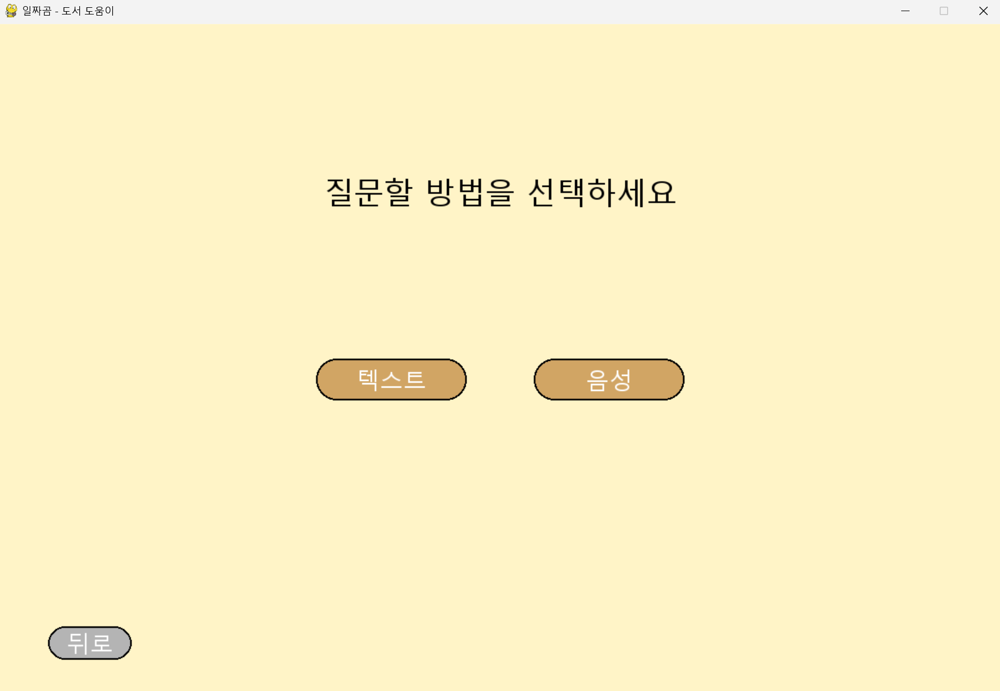
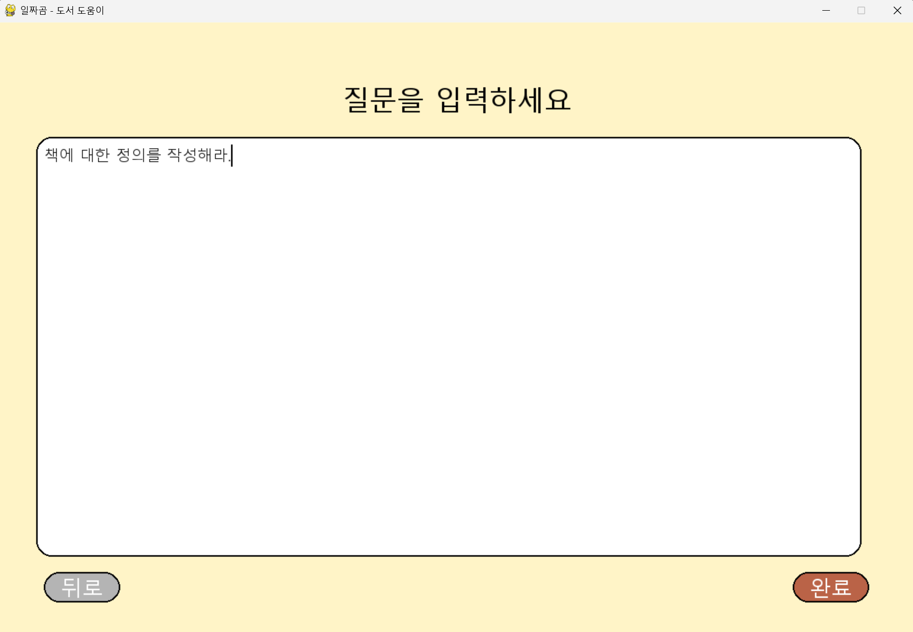
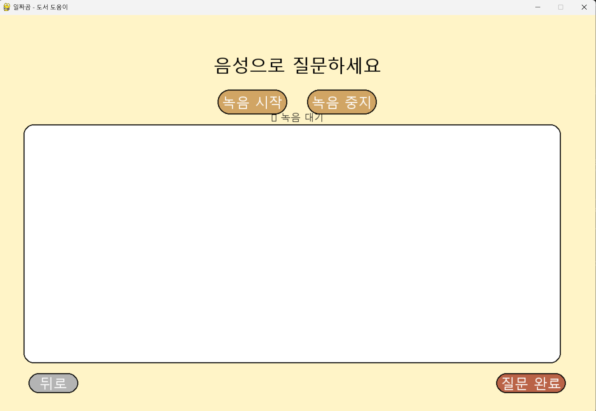
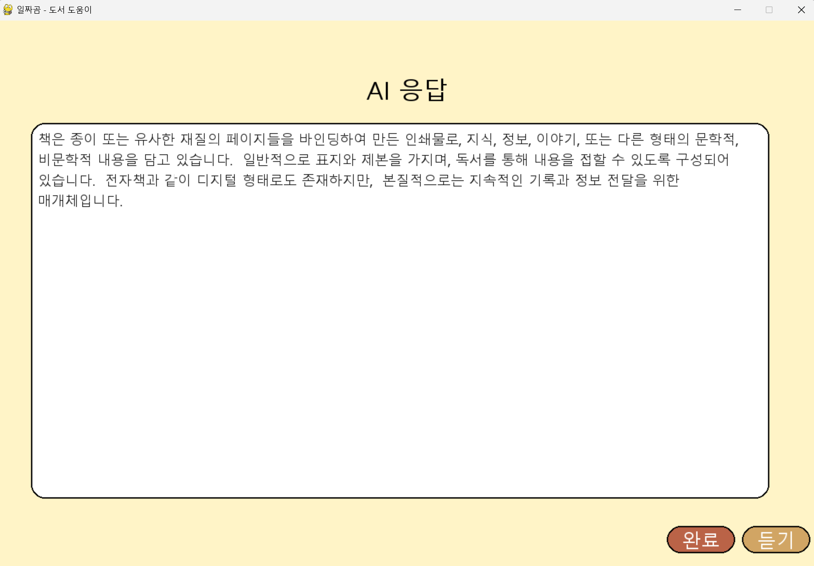

# 일짜곰 (iljjagom) - AI 도서 인식 및 질문 답변 시스템

**일짜곰**은 책의 내용을 카메라로 인식하고, 인식된 내용이나 일반적인 주제에 대해 음성 또는 텍스트로 자유롭게 질문하며 AI의 답변을 받을 수 있는 파이썬 기반의 데스크톱 애플리케이션입니다.

## 주요 기능

- **실시간 도서 인식 (YOLOv5)**: YOLOv5 모델을 사용하여 카메라 영상에서 책(문서)을 실시간으로 탐지합니다.
- **자동 텍스트 추출 (Clova OCR)**: 책이 3초 이상 안정적으로 감지되면 자동으로 해당 부분을 캡처하여 Clova OCR로 텍스트를 추출합니다.
- **지능형 질문 분류**: AI가 사용자의 질문을 분석하여 책 내용이 필요한지 자동으로 판단합니다.
- **음성 질문 인식 (OpenAI STT)**: OpenAI의 gpt-4o-transcribe 모델을 사용하여 사용자의 음성을 텍스트로 정확하게 변환합니다.
- **AI 텍스트 답변 (Google Gemini)**: Google의 Gemini 1.5 Flash 모델을 통해 사용자의 질문에 대한 답변을 생성합니다.
- **AI 음성 답변 (OpenAI TTS)**: OpenAI의 gpt-4o-mini-tts 모델을 사용하여 생성된 AI의 답변을 자연스러운 음성으로 들을 수 있습니다.
- **직관적인 UI**: Pygame을 활용한 한글 완전 지원 사용자 인터페이스
- **대화 기록 저장**: 모든 질문-답변, 캡처 이미지, OCR 결과를 JSON 형태로 자동 저장합니다.

## 시스템 요구사항

- Python 3.9 이상
- Pygame 및 기타 라이브러리 (requirements.txt 참조)
- 웹캠 및 마이크

## 설치 방법

1.  **저장소 복제**
    ```bash
    git clone https://github.com/your-username/iljjagom.git
    cd iljjagom
    ```

2.  **가상 환경 생성 및 활성화**
    ```bash
    # Windows
    python -m venv venv
    venv\Scripts\activate

    # macOS / Linux
    python3 -m venv venv
    source venv/bin/activate
    ```

3.  **의존성 설치**
    ```bash
    pip install -r requirements.txt
    ```

## `.env` 환경 변수 설정

프로젝트를 실행하려면 3가지 서비스의 API 키 설정이 필요합니다. 프로젝트 루트 디렉터리에 `.env` 파일을 생성하고 아래 내용을 모두 채워주세요.

```env
# Naver Cloud Platform의 Clova OCR API 정보
CLOVA_API_URL=YOUR_CLOVA_OCR_API_URL
CLOVA_SECRET_KEY=YOUR_CLOVA_OCR_SECRET_KEY

# Google AI Studio에서 발급받은 Gemini API 키 (AI 텍스트 답변용)
GEMINI_API_KEY=YOUR_GEMINI_API_KEY

# OpenAI API 키 (음성 인식 및 음성 출력용)
OPENAI_API_KEY=YOUR_OPENAI_API_KEY
```

-   `CLOVA_API_URL`, `CLOVA_SECRET_KEY`: [Naver Cloud Platform](https://www.ncloud.com/)에서 **Clova OCR** 서비스를 신청하고 발급받은 API 정보를 입력합니다.
-   `GEMINI_API_KEY`: [Google AI Studio](https://aistudio.google.com/app/apikey)에서 **Gemini** API 키를 발급받아 입력합니다.
-   `OPENAI_API_KEY`: [OpenAI Platform](https://platform.openai.com/)에서 **STT**와 **TTS**를 위한 API 키를 발급받아 입력합니다.

## 실행 방법

프로젝트 루트 디렉터리에서 아래 명령어를 실행하여 애플리케이션을 시작합니다.

```bash
python core/main.py
```

### 실행 옵션 (Arguments)

프로그램 실행 시 다양한 옵션을 지정할 수 있습니다:

```bash
# 기본 실행
python core/main.py

# 다른 카메라 사용 (카메라 인덱스 1번)
python core/main.py --source 1

# 감지 신뢰도 조정 (기본값: 0.7)
python core/main.py --conf_thres 0.8

# 특정 마이크 사용 (마이크 인덱스 1번)
python core/main.py --mic 1

# 자동 TTS 재생 활성화
python core/main.py --tts

# 특정 TTS 목소리 지정
python core/main.py --tts --tts-v nova
```

**사용 가능한 모든 옵션:**
- `--source INDEX`: 카메라 인덱스 (기본값: 0)
- `--conf_thres FLOAT`: YOLOv5 감지 신뢰도 임계값 (기본값: 0.7)
- `--iou_thres FLOAT`: NMS IoU 임계값 (기본값: 0.45)
- `--max_det INT`: 이미지당 최대 감지 개수 (기본값: 1)
- `--mic INDEX`: 마이크 장치 번호 (기본값: -1, 시스템 기본 장치)
- `--tts`: AI 응답 시 자동으로 TTS 재생
- `--tts-v VOICE`: TTS 목소리 이름 (alloy, ash, ballad, coral, echo, fable, nova, onyx, sage, shimmer)

## 인터페이스 설명

| 시작 화면 | 질문 방법 선택 |
| :---: | :---: |
|  |  |
| **질문하기**를 눌러 시작합니다. | **책 인식, 텍스트, 음성** 중 원하는 질문 방식을 선택합니다. |

| 책 인식 (OCR) | 텍스트 입력 |
| :---: | :---: |
|  |  |
| 카메라에 책을 비추면 5초 후 자동 캡처됩니다. | 키보드로 자유롭게 질문을 입력합니다. |

| 음성 입력 | AI 응답 |
| :---: | :---: |
|  |  |
| **녹음 시작/중지**로 질문을 녹음하고 **질문 완료**를 누릅니다. | AI가 생성한 답변을 확인하고, **듣기** 버튼으로 음성 재생이 가능합니다. |

## 시스템 구조 및 코드 설명

일짜곰은 모듈화된 설계를 통해 각 기능을 독립적으로 관리합니다. core 폴더 내의 주요 모듈들을 상세히 설명합니다.

### 1. main.py - 메인 애플리케이션 진입점

메인 애플리케이션 클래스인 `MainApp`은 모든 시스템 모듈을 초기화하고 통합 관리하는 역할을 수행합니다.

```python
class MainApp:
    def __init__(self, camera_source=0, mic=None, tts_enabled=False, tts_voice=None):
        self.conversation_file = "conversation/record.json"
        self.camera_source = camera_source
        self.initialize_records()

        # 각 시스템 모듈 초기화
        self.ai_system = AISystem()
        self.inform_system = InformSystem()
        self.book_detector = BookDetector(inform_system=self.inform_system, camera_source=camera_source)
        self.voice_system = VoiceSystem(input_device_index=mic)
```

**주요 기능:**
- **모듈 통합 관리**: AI 시스템, 책 감지, 음성 시스템, OCR 시스템을 하나의 애플리케이션으로 통합합니다.
- **대화 기록 관리**: JSON 형태로 모든 대화 세션을 자동 저장하며, 사용자 질문, AI 응답, 캡처된 이미지, OCR 결과, 음성 파일 경로를 포함합니다.
- **명령행 인수 처리**: argparse를 사용하여 카메라 소스, 감지 임계값, 마이크 설정, TTS 옵션 등을 동적으로 설정할 수 있습니다.

### 2. ai_system.py - AI 응답 생성 및 질문 분류 시스템

Google Gemini API를 활용한 AI 응답 시스템과 질문 분류 시스템을 구현합니다.

```python
def judge_question(self, user_question):
    prompt = f"{user_question}\n\n위 질문에 답하기 위해 책의 내용이 필요하면 'True', 필요하지 않으면 'False'를 출력하세요."
    response = self._AI(prompt, fine_tuning=self.judge_fine_tuning)
    resp = (response or "").strip().lower()
    return resp == "true"
```

**핵심 기능:**
- **지능형 질문 분류**: Fine-tuning 데이터를 활용하여 사용자의 질문이 책 내용을 필요로 하는지 자동 판단합니다. 8개의 예시 질문-답변 쌍을 통해 분류 정확도를 향상시킵니다.
- **컨텍스트 기반 응답**: 책 내용이 필요한 경우 OCR 텍스트와 사용자 질문을 결합하여 맥락에 맞는 답변을 생성합니다.
- **에러 핸들링**: API 호출 실패 시 명확한 오류 메시지를 반환하여 사용자 경험을 개선합니다.

### 3. detect_sys.py - YOLOv5 기반 실시간 책 감지 시스템

YOLOv5를 활용한 실시간 문서 감지 및 안정성 검증 시스템입니다.

```python
def is_stable(self, prev_box, curr_box, iou_threshold=0.7, center_threshold=30):
    # IoU 계산
    interArea = max(0, xB - xA) * max(0, yB - yA)
    iou = interArea / float(boxAArea + boxBArea - interArea)
    
    # 중심점 거리 계산
    prev_center = ((prev_box[0] + prev_box[2]) / 2, (prev_box[1] + prev_box[3]) / 2)
    curr_center = ((curr_box[0] + curr_box[2]) / 2, (curr_box[1] + curr_box[3]) / 2)
    dist = ((prev_center[0] - curr_center[0]) ** 2 + (prev_center[1] - curr_center[1]) ** 2) ** 0.5
    
    return iou > iou_threshold and dist < center_threshold
```

**핵심 기능:**
- **실시간 감지**: 웹캠을 통해 실시간으로 문서를 감지하며, 커스텀 훈련된 YOLOv5 모델을 우선 사용합니다.
- **안정성 검증**: IoU(Intersection over Union)와 중심점 거리를 기반으로 3초간 안정적으로 감지된 경우만 캡처하여 오탐지를 방지합니다.
- **시각적 피드백**: OpenCV를 통해 실시간으로 감지 상태와 남은 시간을 화면에 표시합니다.

### 4. inform_sys.py - OCR 및 이미지 처리 시스템

Naver Clova OCR을 활용한 텍스트 추출 및 이미지 처리 시스템입니다.

```python
def process_capture(self, capture_info):
    frame = capture_info['frame']
    bbox = capture_info['bbox']
    
    # 바운딩 박스 기준으로 이미지 크롭 및 패딩 추가
    x1, y1, x2, y2 = bbox
    padding = 10
    height, width = frame.shape[:2]
    x1 = max(0, x1 - padding)
    y1 = max(0, y1 - padding)
    x2 = min(width, x2 + padding)
    y2 = min(height, y2 + padding)
```

**핵심 기능:**
- **이미지 전처리**: 바운딩 박스 기준으로 이미지를 크롭하고 10픽셀 패딩을 추가하여 OCR 정확도를 향상시킵니다.
- **파일 안전 저장**: 임시 파일 생성 후 원자적 이동(atomic move)을 통해 파일 충돌을 방지하고 안전하게 저장합니다.
- **Clova OCR 통합**: REST API를 통해 Naver Clova OCR에 요청하며, 한국어 텍스트 인식에 특화되어 있습니다.

### 5. voice_sys.py - 음성 인식 및 합성 시스템

OpenAI의 STT/TTS 모델을 활용한 음성 처리 시스템입니다.

```python
def start_recording(self):
    # 장치별 최적 설정 자동 감지
    device_info = self.p.get_device_info_by_index(self.input_device_index)
    device_rate = int(device_info.get('defaultSampleRate', self.rate))
    device_channels = int(max(1, min(self.channels, max_in)))
    
    # 여러 설정으로 자동 재시도
    attempts = [
        {'channels': device_channels, 'rate': device_rate},
        {'channels': 1, 'rate': device_rate},
        {'channels': 1, 'rate': 44100}
    ]
```

**핵심 기능:**
- **적응형 녹음**: 다양한 오디오 장치에 대해 자동으로 최적 설정을 찾고, 실패 시 여러 설정으로 재시도합니다.
- **실시간 STT**: OpenAI의 gpt-4o-transcribe 모델을 사용하여 한국어 음성을 정확하게 텍스트로 변환합니다.
- **고품질 TTS**: gpt-4o-mini-tts 모델을 사용하여 자연스러운 음성을 생성하며, 10가지 목소리 옵션을 제공합니다.

### 6. interface.py - Pygame 기반 사용자 인터페이스

한글을 완전 지원하는 직관적인 GUI 인터페이스를 제공합니다.

```python
class TextInputBox:
    def _handle_text_input(self, text):
        current_line = self.text_lines[self.cursor_line]
        new_line = current_line[:self.cursor_pos] + text + current_line[self.cursor_pos:]
        
        # 자동 줄바꿈 처리
        if self.font.size(new_line)[0] > self.text_area_width:
            words = new_line.split(' ')
            lines, current_line_text = [], ''
            for word in words:
                test_line = current_line_text + (' ' + word if current_line_text else word)
                if self.font.size(test_line)[0] <= self.text_area_width:
                    current_line_text = test_line
                else:
                    if current_line_text: 
                        lines.append(current_line_text)
                    current_line_text = word
```

**핵심 기능:**
- **한글 폰트 지원**: Windows 시스템 폰트를 자동 감지하여 완전한 한글 지원을 제공합니다.
- **고급 텍스트 입력**: 자동 줄바꿈, 커서 이동, 스크롤, 텍스트 선택 등의 기능을 구현하여 사용자 편의성을 극대화합니다.
- **비동기 처리**: Threading을 활용하여 OCR, STT, TTS 작업을 백그라운드에서 처리하며 UI 응답성을 유지합니다.
- **상태 관리**: 5개의 화면 상태(시작, 질문 방법 선택, 텍스트 입력, 음성 입력, AI 응답)를 체계적으로 관리합니다.

### 7. config.py - 설정 및 상수 관리

애플리케이션 전반의 설정값과 UI 색상을 중앙 집중식으로 관리합니다.

**주요 구성 요소:**
- **색상 팔레트**: 일관된 UI 디자인을 위한 색상 상수들을 정의합니다.
- **화면 설정**: 애플리케이션 창 크기와 폰트 크기를 설정합니다.
- **Fine-tuning 데이터**: AI 질문 분류를 위한 8개의 예시 질문-답변 쌍을 포함합니다.

이러한 모듈화된 구조를 통해 각 기능을 독립적으로 개발하고 유지보수할 수 있으며, 새로운 기능 추가나 기존 기능 개선이 용이합니다.

## 기술적 특징

### 1. 안정적인 책 감지 알고리즘
- **IoU 기반 안정성 검증**: 연속된 프레임에서 바운딩 박스의 겹침 정도를 계산하여 안정성을 판단합니다.
- **중심점 거리 임계값**: 바운딩 박스 중심점의 이동 거리가 30픽셀 이내일 때 안정적으로 판단합니다.
- **3초 안정성 보장**: 카메라 흔들림이나 일시적인 가림 현상을 방지하기 위해 3초간 지속적인 감지를 요구합니다.

### 2. 지능형 질문 분류 시스템
- **Fine-tuning 기반 분류**: 8개의 예시 질문-답변 쌍을 통해 분류 정확도를 향상시킵니다.
- **이진 분류**: 질문이 책 내용을 필요로 하는지 True/False로 명확하게 분류합니다.
- **컨텍스트 보존**: 책 내용이 필요한 경우 OCR 결과와 질문을 결합하여 맥락 있는 답변을 생성합니다.

### 3. 멀티모달 입출력 지원
- **음성 인식**: 한국어에 특화된 STT로 자연스러운 음성 질문을 지원합니다.
- **음성 합성**: 10가지 목소리 옵션으로 개인화된 TTS 경험을 제공합니다.
- **텍스트 입력**: 자동 줄바꿈과 스크롤을 지원하는 고급 텍스트 에디터를 제공합니다.

### 4. 강건한 파일 시스템
- **원자적 파일 저장**: 임시 파일 생성 후 이동하는 방식으로 파일 손상을 방지합니다.
- **자동 백업**: 파일명 충돌 시 자동으로 새로운 이름을 생성하여 데이터 손실을 방지합니다.
- **구조화된 저장**: 대화 기록, 이미지, OCR 결과, 음성 파일을 체계적으로 분류하여 저장합니다.

## 성능 최적화

### 1. 비동기 처리
- **Threading 활용**: OCR, STT, TTS 작업을 백그라운드에서 처리하여 UI 반응성을 유지합니다.
- **논블로킹 UI**: 로딩 중에도 사용자가 다른 작업을 수행할 수 있도록 설계되었습니다.

### 2. 메모리 효율성
- **스트리밍 처리**: 오디오 데이터를 청크 단위로 처리하여 메모리 사용량을 최소화합니다.
- **리소스 정리**: 사용이 끝난 리소스를 즉시 해제하여 메모리 누수를 방지합니다.

### 3. 에러 복구
- **Graceful Degradation**: 하나의 모듈이 실패해도 전체 시스템이 중단되지 않도록 설계되었습니다.
- **자동 재시도**: 네트워크 오류나 일시적인 장치 문제 시 자동으로 재시도합니다.
