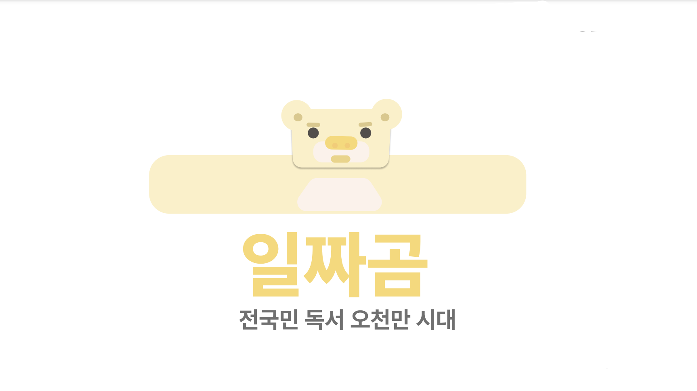
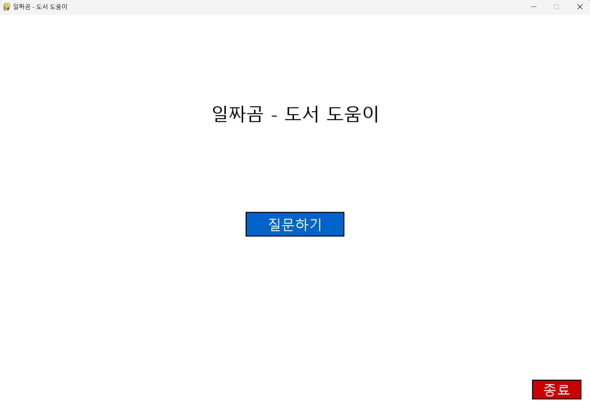
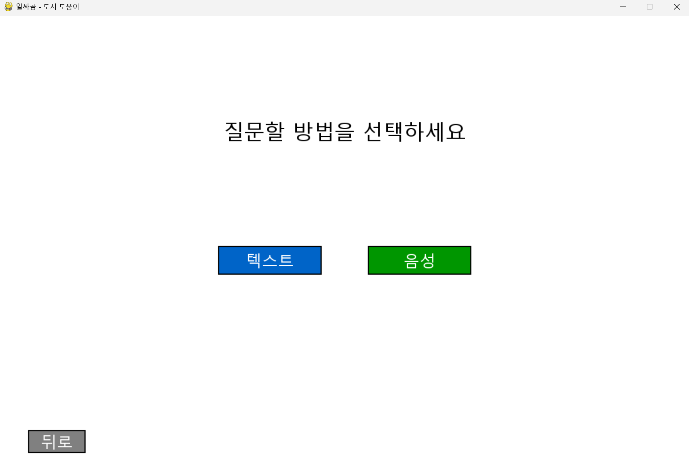
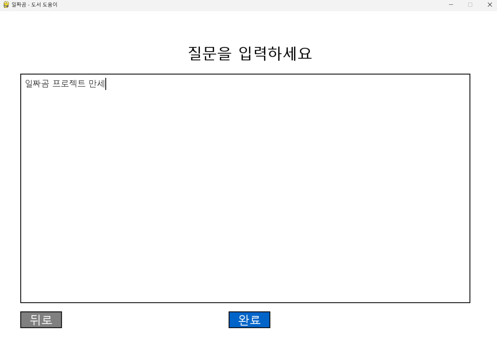
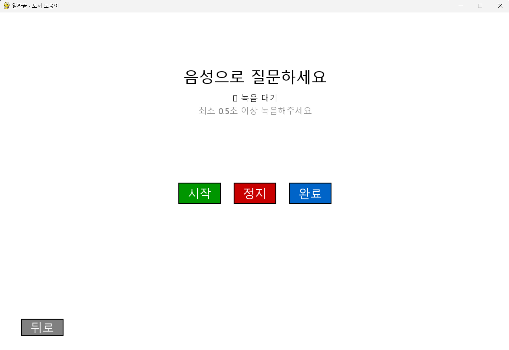
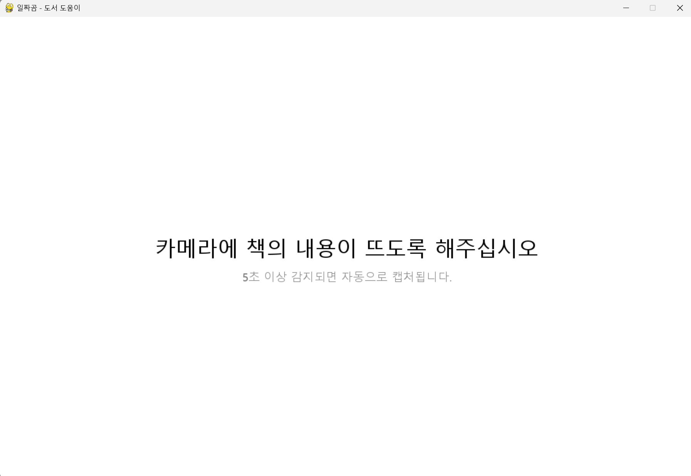
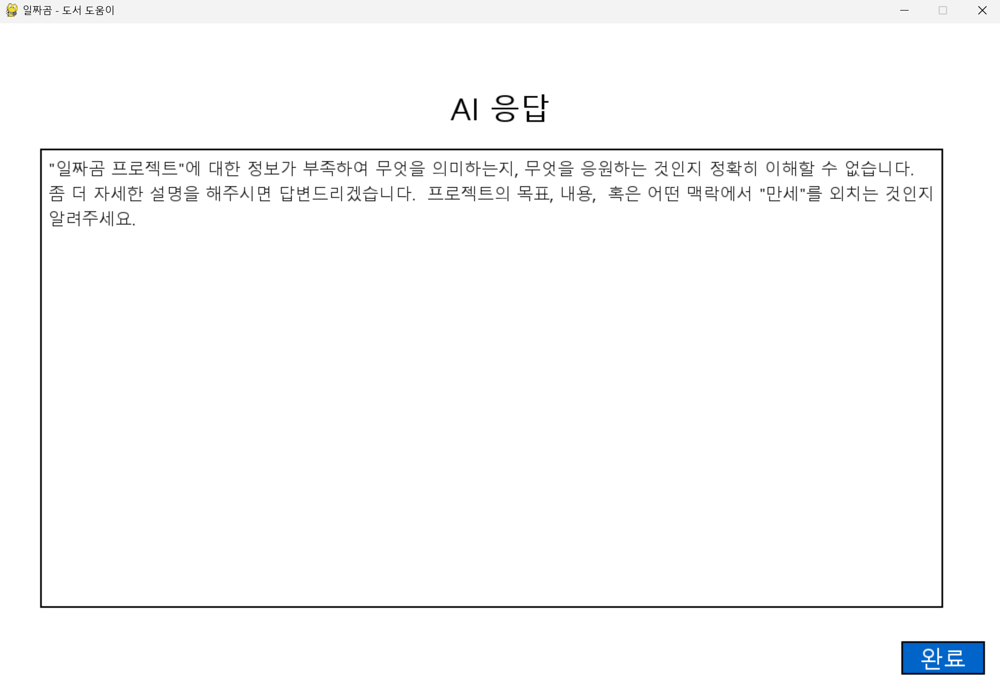

# 일짜곰 (Iljjagom) - AI 기반 문서 인식 및 질의응답 시스템



## 프로젝트 개요

도서 도움이(일짜곰)은 사회인들의 줄어드는 독서량, 낮은 문해력 문제를 해결하기 위해서 제작되었습니다.

일짜곰은 카메라를 통해 책이나 문서를 실시간으로 감지하고, OCR을 통해 텍스트를 추출한 후 AI를 활용하여 사용자의 질문에 답변하는 통합 시스템입니다. YOLOv5 기반의 커스텀 문서 감지 모델, Tesseract OCR, OpenAI STT/TTS, Google Gemini AI를 조합하여 구현되었습니다.

## 시스템 아키텍처

```
사용자 입력 (텍스트/음성) → 문서 감지 → 이미지 캡처 → OCR 처리 → AI 분석 → 응답 생성 → 음성/텍스트 출력
```

## 설치 및 설정

### 1. 기본 환경 설정

```bash
# 저장소 클론
git clone https://github.com/your-repo/iljjagom.git
cd iljjagom

# Python 가상환경 생성 (권장)
python -m venv venv
source venv/bin/activate  # Linux/Mac
# 또는
venv\Scripts\activate     # Windows

# 의존성 설치
pip install -r requirements.txt
```

### 2. Tesseract OCR 설치

#### Windows
1. [Tesseract OCR 다운로드](https://github.com/UB-Mannheim/tesseract/wiki)
2. 설치 시 한국어 언어팩(kor.traineddata) 포함 선택
3. 기본 설치 경로: `C:\Program Files\Tesseract-OCR\tesseract.exe`

#### Linux/Mac
```bash
# Ubuntu/Debian
sudo apt-get install tesseract-ocr tesseract-ocr-kor

# macOS
brew install tesseract tesseract-lang
```

### 3. API 키 설정

프로젝트 루트에 `.env` 파일 생성:
```bash
OPENAI_API_KEY=your_openai_api_key_here
GEMINI_API_KEY=your_gemini_api_key_here
CLOVA_URL=your_clova_invoke_url_here
CLOVA_API_KEY=your_clova_api_key_here
```

**API 키 발급 방법:**
- **OpenAI API**: [OpenAI Platform](https://platform.openai.com/api-keys)에서 발급
- **Google Gemini API**: [Google AI Studio](https://aistudio.google.com/app/apikey)에서 발급
- **Naver Clova API**: [Naver Cloud Platform](https://www.ncloud.com/)에서 Clova Speech Recognition 서비스 생성 후 발급

### 4. 커스텀 모델 다운로드

YOLOv5 커스텀 훈련 모델이 필요합니다:
```bash
# 모델 파일 경로 확인
runs/train/document_yolov5s_results/weights/best.pt
```

## 실행 방법

### 기본 실행
```bash
python core/main.py        # 기본 카메라 (인덱스 0)
python core/main.py 1      # 1번 카메라 사용
python core/main.py 2      # 2번 카메라 사용
```

### 사용 과정
1. **시작화면**: "질문하기" 버튼 클릭
2. **입력 방식 선택**: 텍스트 또는 음성 선택
3. **질문 입력**: 
   - 텍스트: 직접 타이핑
   - 음성: 시작→정지→완료 순서로 녹음
4. **문서 촬영**: 카메라에 책/문서가 5초간 안정적으로 감지되면 자동 캡처
5. **AI 응답 확인**: OCR 텍스트를 바탕으로 한 AI 답변 확인

## 파일 구조

```
iljjagom/
├── core/                           # 핵심 시스템 모듈
│   ├── main.py                     # 메인 애플리케이션 컨트롤러
│   ├── interface.py                # Pygame 기반 사용자 인터페이스
│   ├── detect_sys.py               # YOLOv5 문서 감지 시스템
│   ├── inform_sys.py               # 이미지 캡처 및 OCR 처리
│   ├── ai_system.py                # Gemini AI 통합 시스템
│   └── voice_sys.py                # OpenAI 음성 인식/합성 시스템
├── conversation/                   # 대화 기록 저장소
│   ├── record.json                 # 대화 세션 메타데이터
│   ├── image/                      # 캡처된 이미지들
│   ├── ocr/                        # OCR 결과 텍스트 파일들
│   └── voice/                      # 녹음된 음성 파일들
├── models/                         # YOLOv5 모델 정의
├── utils/                          # YOLOv5 유틸리티 함수들
├── data/                           # 데이터셋 설정 파일들
├── runs/train/document_yolov5s_results/weights/
│   └── best.pt                     # 커스텀 훈련된 문서 감지 모델
├── test_code/                      # 테스트 및 검증 스크립트들
└── requirements.txt                # 의존성 패키지 목록
```

## 핵심 모듈 설명

### 1. main.py - 메인 애플리케이션 컨트롤러

```python
class MainApp:
    def __init__(self, camera_source=0):
        # 모든 핵심 시스템 초기화
        self.interface = ReadAIInterface()
        self.detect_system = BookDetector(inform_system, camera_source=camera_source)
        self.inform_system = InformSystem()
        self.ai_system = AISystem()
        self.voice_system = VoiceSystem()
```

**주요 기능:**
- 모든 서브시스템 초기화 및 통합
- 사용자 입력 방식 (텍스트/음성) 결정
- 대화 세션 기록 관리 (JSON 형태)
- 시스템 간 데이터 플로우 제어

### 2. interface.py - 사용자 인터페이스

```python
class ReadAIInterface:
    def __init__(self):
        self.screen = pygame.display.set_mode((800, 600))
        self.font = pygame.font.Font("fonts/NanumGothic.ttf", 20)
```

**주요 기능:**
- Pygame 기반 GUI 구현
- 한국어 폰트 지원 (나눔고딕)
- 4개 화면: 시작화면, 텍스트입력, 음성입력, 응답표시
- 텍스트 자동 줄바꿈 및 스크롤 기능
- 실시간 음성 녹음 시각적 피드백

#### 시작 화면


#### 질문 방법 선택 화면


#### 질문(텍스트) 입력 화면


#### 질문(음성) 입력 화면


#### YOLOv5 detect 대기 화면


#### AI 응답 화면


### 3. detect_sys.py - 문서 감지 시스템

```python
class BookDetector:
    def __init__(self, inform_system, weights=None, camera_source=0):
        self.model = DetectMultiBackend(weights, device=self.device)
        self.names = self.model.names  # 클래스 이름: {0: 'document'}
```

**주요 기능:**
- YOLOv5 기반 실시간 문서 감지
- 커스텀 훈련 모델 사용 (document 클래스, 신뢰도 0.6 이상)
- 5초간 안정적 감지 후 자동 캡처
- OpenCV 기반 카메라 제어 및 바운딩 박스 표시
- ESC 키로 감지 중단 가능

**감지 로직:**
1. 카메라에서 프레임 읽기
2. YOLOv5 모델로 추론
3. 'document' 클래스 감지 시 바운딩 박스 표시
4. 동일 위치에서 5초간 안정적 감지 확인
5. 조건 만족 시 자동 캡처 및 OCR 진행

### 4. inform_sys.py - 이미지 처리 및 OCR

```python
class InformSystem:
    def perform_ocr(self, image_path):
        # 다중 전처리 방법 적용
        # 1. 적응적 이진화
        # 2. OTSU 이진화  
        # 3. 원본 그레이스케일
        # 가장 긴 결과 선택
```

**주요 기능:**
- 바운딩 박스 기반 이미지 자르기 (여백 추가)
- 이미지 품질 향상 (크기 조정, 노이즈 제거)
- Tesseract OCR 다중 처리 방법
- 한국어+영어 언어팩 사용 (kor+eng)
- 다양한 PSM/OEM 모드로 최적 결과 선택

**OCR 전처리 과정:**
1. 바운딩 박스에 10px 여백 추가
2. 200px 미만 이미지 자동 확대
3. 그레이스케일 변환 및 노이즈 제거
4. 적응적 이진화/OTSU 이진화 적용
5. 5가지 PSM 모드로 OCR 수행
6. 가장 긴 결과를 최종 선택

### 5. ai_system.py - AI 분석 및 응답

```python
class AISystem:
    def __init__(self):
        self.client = genai.GenerativeModel('gemini-1.5-flash')
        self.system_instruction = "당신은 한국어로 답변하는 도서 도우미..."
```

**주요 기능:**
- Google Gemini 1.5 Flash 모델 사용
- 한국어 도서 도우미 시스템 지시문 적용
- 질문 유형 분석 (book_related, general, unclear)
- Few-shot learning 예시 포함
- OCR 텍스트와 사용자 질문 통합 분석

**AI 응답 프로세스:**
1. 사용자 질문 유형 분석
2. OCR 텍스트와 질문 결합한 프롬프트 생성
3. Gemini API 호출로 응답 생성
4. 한국어 자연어 응답 반환

### 6. voice_sys.py - 음성 처리

```python
class VoiceSystem:
    def __init__(self):
        self.client = OpenAI()
        self.is_recording = False
        self.audio_data = []
```

**주요 기능:**
- OpenAI Whisper API 기반 STT
- 실시간 음성 녹음 (16kHz, 16bit, mono)
- 최소 1초 이상 녹음 검증
- 녹음 파일 자동 저장 (conversation/voice/)
- pyaudio 기반 오디오 스트림 제어

**음성 처리 플로우:**
1. 사용자가 녹음 시작/중지
2. 실시간으로 오디오 데이터 수집
3. WAV 형태로 임시 저장
4. OpenAI Whisper API로 텍스트 변환
5. 원본 음성 파일 영구 보존

## 대화 기록 시스템

### conversation/record.json 구조
```json
{
    "total_conversations": 1,
    "records": [
        {
            "id": 1,
            "timestamp": "2024-08-11T13:45:23",
            "user_prompt": "이 책의 주제가 뭐야?",
            "edited_prompt": "다음 OCR 텍스트를 참고하여... [사용자 질문: 이 책의 주제가 뭐야?]",
            "ai_response": "이 문서는 OCR 테스트에 관한 내용입니다...",
            "image_path": "conversation/image/capture_20240811_134523.jpg",
            "ocr_text_path": "conversation/ocr/ocr_20240811_134523.txt", 
            "voice_path": "conversation/voice/recording_20240811_134523.wav"
        }
    ]
}
```

## 성능 특징 및 제한사항

### OCR 성능
- **영어 텍스트**: 95% 이상 정확도
- **한국어 텍스트**: 85% 이상 정확도 (글자 간격 문제 존재)
- **혼합 텍스트**: 영어와 한국어 동시 인식 가능
- **숫자/특수문자**: 높은 인식률
- **최적 조건**: 명확한 폰트, 충분한 조명, 정면 촬영

### 문서 감지 성능
- **감지 속도**: 실시간 (30fps)
- **정확도**: 신뢰도 0.6 이상 필터링
- **안정성**: 5초 연속 감지로 오감지 방지
- **지원 문서**: 책, 논문, 프린트물 등

### AI 응답 품질
- **한국어 자연어 처리**: Gemini 1.5 Flash 기반 높은 품질
- **문맥 이해**: OCR 텍스트 기반 정확한 분석
- **응답 속도**: 평균 2-5초
- **토큰 제한**: 입력 최대 1M 토큰, 출력 최대 8K 토큰

## 문제 해결

### 일반적인 문제

#### 1. Tesseract OCR 인식 오류
```bash
# 에러: tesseract가 설치되지 않음
TesseractNotFoundError: tesseract is not installed

# 해결책:
# Windows: Tesseract OCR 재설치 및 PATH 확인
# Linux: sudo apt-get install tesseract-ocr tesseract-ocr-kor
```

#### 2. 카메라 접근 오류
```bash
# 에러: 카메라를 찾을 수 없음
Error: Cannot open camera

# 해결책:
python core/main.py 0  # 다른 카메라 인덱스 시도
python core/main.py 1
python core/main.py 2
```

#### 3. API 키 오류
```bash
# 에러: API 키가 유효하지 않음
Error: Invalid API key

# 해결책:
# 1. .env 파일 존재 확인
# 2. API 키 형식 확인 (따옴표 없이 입력)
# 3. API 키 유효성 확인
```

#### 4. 모델 파일 누락
```bash
# 에러: 모델 파일을 찾을 수 없음
FileNotFoundError: runs/train/document_yolov5s_results/weights/best.pt

# 해결책:
# 1. 모델 파일 다운로드 또는 복사
# 2. 경로 확인
# 3. 기본 YOLOv5s 모델 사용: yolov5s.pt
```

### 성능 최적화 팁

#### OCR 성능 향상
1. **조명**: 균등하고 충분한 조명 사용
2. **각도**: 문서를 정면에서 촬영
3. **거리**: 문서가 화면의 70% 이상 차지하도록 조정

#### 음성 인식 성능 향상
1. **환경**: 조용한 환경에서 녹음
2. **거리**: 마이크에서 30cm 이내
3. **속도**: 천천히 명확하게 발음
4. **길이**: 최소 1초 이상 녹음

## 개발 정보

### 시스템 요구사항
- **운영체제**: Windows 10+, macOS 10.15+, Ubuntu 18.04+
- **Python**: 3.8 이상
- **메모리**: 최소 4GB RAM (8GB 권장)
- **저장공간**: 최소 2GB (모델 및 대화 기록 포함)
- **카메라**: 웹캠 또는 외장 카메라

### 의존성 버전
- **torch**: 2.0.0+
- **opencv-python**: 4.8.0+
- **pygame**: 2.5.0+
- **pytesseract**: 0.3.10+
- **openai**: 1.0.0+
- **google-generativeai**: 0.3.0+

### 라이선스
MIT License - 자세한 내용은 LICENSE 파일 참조

## 향후 개선 사항

### 단기 목표 (v2.0)
1. **OCR 정확도 향상**: 한국어 글자 간격 문제 해결
2. **UI/UX 개선**: 더 직관적인 인터페이스 설계
3. **설정 기능**: 카메라, OCR, AI 모델 설정 옵션
4. **다국어 지원**: 영어, 일본어, 중국어 추가

### 장기 목표 (v3.0)
1. **대화 기억 기능**: 이전 대화 맥락을 기억하는 연속 대화
2. **문서 검색 기능**: 과거 OCR 텍스트에서 키워드 검색
3. **클라우드 동기화**: 여러 기기 간 대화 기록 동기화
4. **모바일 앱**: Android/iOS 앱 개발
